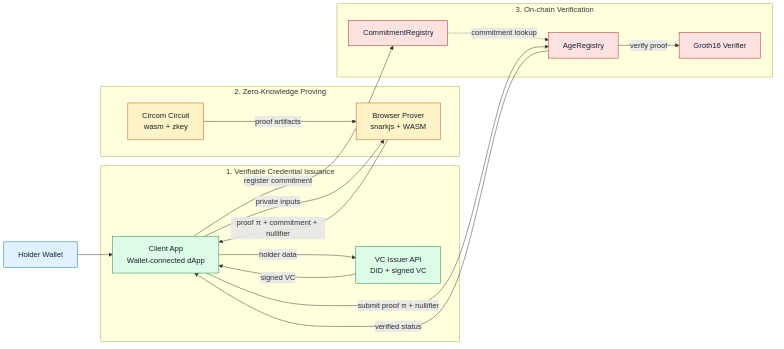
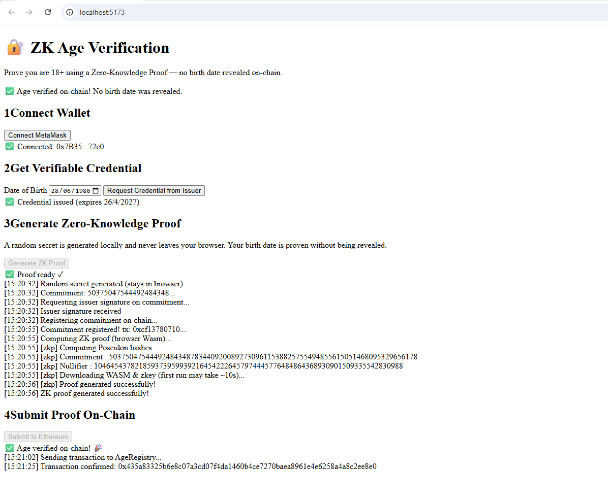

# VC Age Verification with ZKP + Ethereum


A privacy-preserving age verification system that combines **Verifiable Credentials (W3C VCs)**, **Zero-Knowledge Proofs (Groth16/BN254)**, and **Ethereum Smart Contracts** to prove "I am 18+" without revealing the actual birth date.

## Trust Model

- Trusted VC Issuer: the issuer signs verifiable credentials and authorizes the holder's commitment.
- Trustless On-chain Verification: Ethereum contracts verify the Groth16 proof and record the verification result without relying on the issuer at verification time.

## Demo

### Architecture Diagram



### Frontend Demo



### ZKP Circuit (Circom)
The circuit proves (without revealing the birth date):
- `Poseidon(birthTimestamp, secret) == commitment` — you know the preimage of the registered commitment
- `currentTimestamp - birthTimestamp >= 567,648,000` — you are at least 18 years old
- `Poseidon(secret, birthTimestamp) == nullifier` — prevents proof reuse

### Smart Contracts (Solidity)
| Contract | Description |
|---|---|
| `IssuerRegistry` | Registry of trusted credential issuers (DIDs ↔ Ethereum addresses) |
| `CommitmentRegistry` | Stores age commitments issued and signed by trusted issuers |
| `AgeVerifier` | Groth16 BN254 verifier (generated from ZKP trusted setup) |
| `AgeRegistry` | Main contract: verifies proof + records attestation with expiry |

### Rust Prover Service
REST API (`axum`) that wraps `ark-circom` + `ark-groth16` to generate proofs natively. In the current demo, the main proving flow runs in the browser, while the Rust prover remains available for alternative server-side or batch proving.

### TypeScript Backend (VC Issuer)
Express server that:
- Issues W3C VCs with birth date (signed with DID key)
- Registers commitment on-chain on behalf of users
- Provides commitment pre-image derivation

### TypeScript Frontend
Vite + vanilla TS app that:
- Reads user's VC
- Computes the ZKP witness and proof in the browser via `snarkjs`
- Submits proof to Ethereum (via ethers.js)

---

## Project Structure

```
vc-age-verification/
├── circuits/            # Circom ZKP circuits + setup scripts
├── contracts/           # Solidity + Hardhat
├── backend/             # TypeScript VC issuer (Node/Express)
├── frontend/            # TypeScript dApp (Vite)
└── prover/              # Rust native prover (Axum REST API)
```

---

## Prerequisites

| Tool | Version | Install |
|---|---|---|
| Node.js | ≥ 20 | https://nodejs.org |
| Rust | ≥ 1.75 | `curl --proto '=https' --tlsv1.2 -sSf https://sh.rustup.rs \| sh` |
| circom | 2.x | Build from source: `cargo install --path circom` (after cloning iden3/circom) |
| snarkjs | latest | `npm i -g snarkjs` |

---

## Setup

### 1. Install dependencies
```bash
npm install          # installs all workspace packages
```

### 2. Compile the circuit & run trusted setup
```bash
cd circuits
bash scripts/compile.sh    # compiles age_check.circom → .r1cs + .wasm
bash scripts/setup.sh      # Powers of Tau + circuit-specific setup
```
> The setup scripts produce `circuits/build/age_check.zkey` and export `contracts/contracts/AgeVerifier.sol` automatically.


### 3 Deploy to local L1
If your L1 docker network is running on `http://127.0.0.1:9545`:

```bash
# from project root
cp .env.example .env

# set these values in .env
# CHAIN_ID=900
# RPC_URL=http://127.0.0.1:9545
# BLOCKCHAIN_LOCAL_RPC_URL=http://127.0.0.1:9545
# DEPLOYER_PRIVATE_KEY=<funded key from L1 genesis>

cd contracts
npm run compile
npm run deploy:blockchain-local
```

Each deploy updates `contracts/deployment-addresses.json` and also syncs these variables in `.env` automatically:
- `COMMITMENT_REGISTRY_ADDRESS`
- `AGE_REGISTRY_ADDRESS`
- `VITE_COMMITMENT_REGISTRY_ADDRESS`
- `VITE_AGE_REGISTRY_ADDRESS`

### 4. Start the VC Issuer backend
```bash
cd backend
npm run dev
```

### 5. Start the Rust prover service
```bash
cd prover
# first run only: installs pinned toolchain from prover/rust-toolchain.toml
rustup toolchain install 1.82.0
cargo run --release
```

### 6. Start the frontend
```bash
cd frontend
npm run dev
```

---

## Tests

The project currently includes automated tests for the backend and smart contracts.

### Run all available tests

From the project root:

```bash
cd backend && npm test
cd ../contracts && npm test
```

### Backend tests

The backend uses Node's test runner through `tsx` for utility and service-level tests.

```bash
cd backend
npm test
```

### Smart contract tests

The contracts use Hardhat + Chai for integration tests covering issuer registration, commitment registration, replay protection, proof validation, and verification expiry.

```bash
cd contracts
npm test
```

You can also run the contract suite from the workspace root with:

```bash
npm run test:contracts
```

### Current status

- Backend: automated tests available and runnable with `npm test`
- Contracts: automated tests available and runnable with `npm test`
- Frontend: no dedicated automated test suite configured yet
- Prover (Rust): no dedicated automated test suite configured yet

---


## Security Notes

- The `AgeVerifier.sol` verification key **MUST** be replaced with values from a real trusted setup ceremony. Never use placeholder zeros in production.
- The nullifier mechanism prevents proof replay attacks.
- Verification attestations expire after 365 days, requiring re-verification.
- Commitments are bound to a specific user address via issuer signature.
